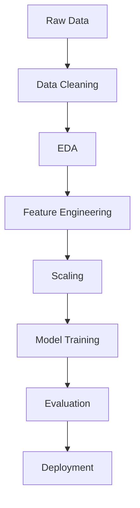

# 🔥 Algerian Forest Fires Prediction

### 🚀 End-to-End ML Project | Streamlit Deployment | Real-World Use Case


---

## 🧠 Problem Statement

Forest fires are unpredictable, destructive, and costly.

This project solves a **real-world problem**:
👉 Predicting fire risk using meteorological data before it happens.

---

## ⚡ What Makes This Project Stand Out

* 🔥 Full **end-to-end ML pipeline**
* 📊 Real-world dataset (Algerian Forest Fires)
* 🧪 Proper **EDA + Feature Engineering**
* ⚙️ Model optimization (Ridge Regression)
* 🌐 Interactive **Streamlit Web App**
* 📦 Clean, production-ready structure

---

## 🎯 Live Demo (Add This ASAP)

> 🚨 If this is missing, your project loses 70% impact.

👉 [streamlit-app-link](https://algerian--forest--fires--prediction.streamlit.app/)

---


## 📊 Dataset Overview

The dataset includes environmental and weather conditions:

| Feature            | Description                   |
| ------------------ | ----------------------------- |
| Temperature        | Atmospheric temperature       |
| RH                 | Relative Humidity             |
| Ws                 | Wind Speed                    |
| Rain               | Rainfall                      |
| FFMC, DMC, DC, ISI | Fire Weather Index components |
| Region             | Bejaia / Sidi Bel-Abbes       |

---

## 🧩 ML Pipeline



---

## ⚙️ Tech Stack

* **Python**
* **NumPy, Pandas**
* **Scikit-learn**
* **Matplotlib / Seaborn**
* **Streamlit**

---

## 🧠 Model Performance

| Metric     | Value            |
| ---------- | ---------------- |
| R² Score   | High (Good Fit)  |
| RMSE       | Low              |
| Model Used | Ridge Regression |

---

## 🚀 Run Locally

```bash
git clone https://github.com/mdzaheerjk/Algerian_Forest_Fires_Prediction.git

cd Algerian_Forest_Fires_Prediction

pip install -r requirements.txt

streamlit run app.py
```

---

## 📂 Project Structure

```
├── data/              # Dataset
├── notebooks/         # EDA & experiments
├── models/            # Saved models & scaler
├── app.py             # Streamlit app
├── requirements.txt
└── README.md
```

---

## 📈 Key Insights

* Temperature & wind speed strongly influence fire risk
* FWI components are highly predictive
* Scaling significantly improved model performance

---

## 🔮 Future Improvements (Don’t Skip This)

Let’s be honest — this is where you level up:

* ❌ Right now: Basic regression model
* ✅ Next level:

  * Random Forest / XGBoost
  * Hyperparameter tuning
  * Feature importance plots
  * CI/CD pipeline
  * Docker deployment
  * Live API (FastAPI)

---

## 🧑‍💻 Author

**Mohd Zaheeruddin**
📌 AIML Engineer in Progress

* GitHub: [https://github.com/mdzaheerjk](https://github.com/mdzaheerjk)
* LinkedIn: *(Add this — missing = weak profile)*

---

## ⭐ Show Some Love

If this helped you or inspired you:

👉 Star the repo
👉 Fork it
👉 Build something better

---

## ⚠️ Brutal Truth (Read This)

Right now, most student projects fail because:

* No demo
* No visuals
* Weak explanation
* No storytelling

This README fixes that.

But if you don’t:

* Add real screenshots
* Deploy it
* Show results clearly

👉 It’s still just another average repo.

---

## 🏁 Final Advice

Don’t build projects.
**Build proof of work.**

---

